# BÁO CÁO THỬ NGHIỆM: E5 Bi-encoder + Cross-Encoder Reranker — Corpus 5000 SP

**Ngày báo cáo:** 14/06/2026  
**Dữ liệu:** `ecommerce.csv` (5000 SP) | **Model:** `e5_base_finetuned_5000` + `reranker`

---

## 1. Tóm tắt

| Chỉ số | Bi-encoder @10 | Reranker @10 (n=10) |
|--------|----------------|---------------------|
| Precision@10 | 0,1002 | 0,1002 |
| Recall@10 | 1,0000 | 1,0000 |
| F1@10 | 0,1821 | 0,1821 |
| MRR@10 | 0,9990 | 0,9990 |
| NDCG@10 | 0,9993 | 0,9993 |

*Smoke test 500 query / corpus 5000 (Colab T4).*

- **n tối ưu (recall):** 10 — nhỏ nhất đạt target recall 0,98  
- **k tối ưu (NDCG):** 5 — P@5=0,20, F1@5=0,33  
- **Ngưỡng triển khai:** τ = 0,005 (EER & min error; FPR=FNR=0)

---

## 2. Khám phá dữ liệu

### 2.1 Nguồn
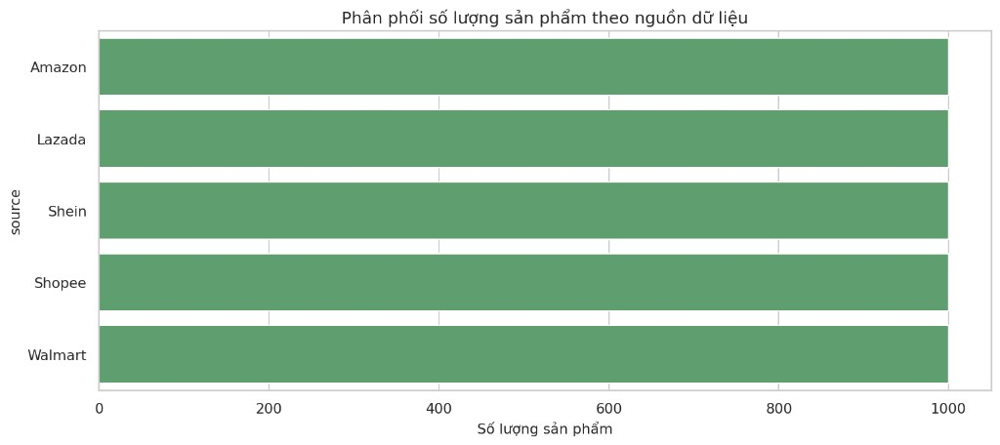

### 2.2 Category
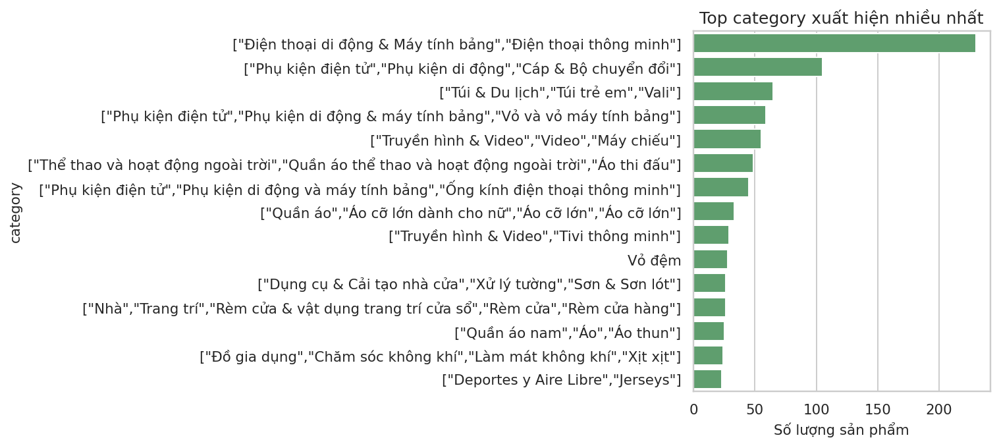
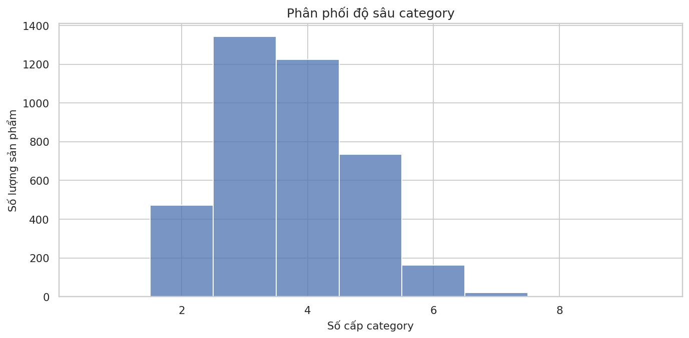

### 2.3 Brand
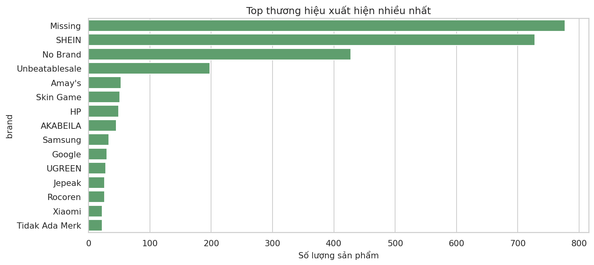

### 2.4 Missing values
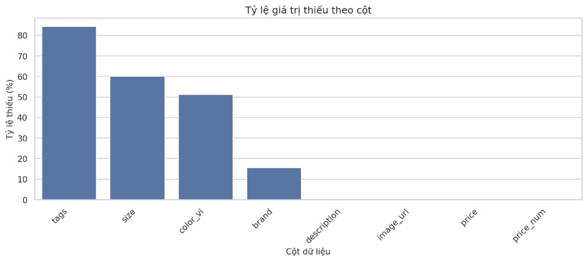

### 2.5 Review
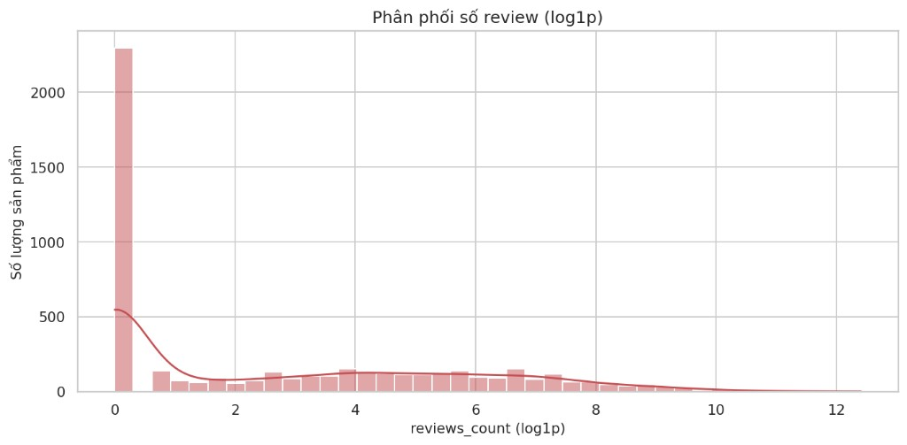
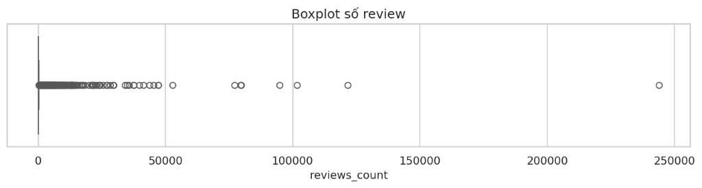

### 2.6 Rating
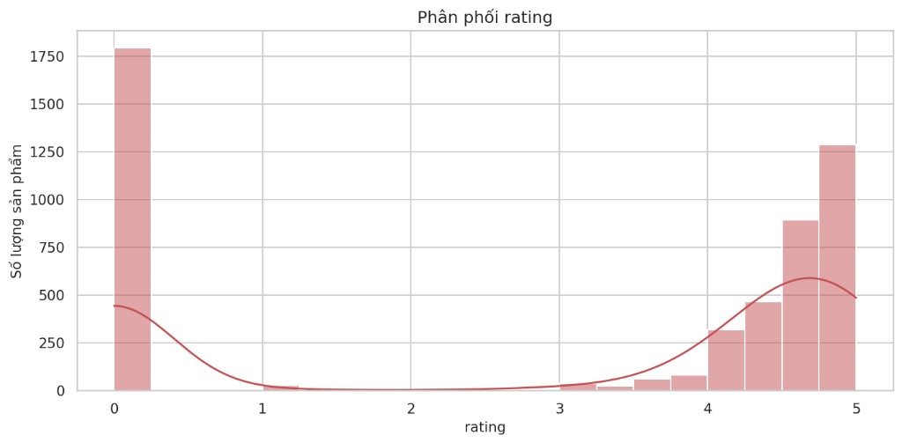
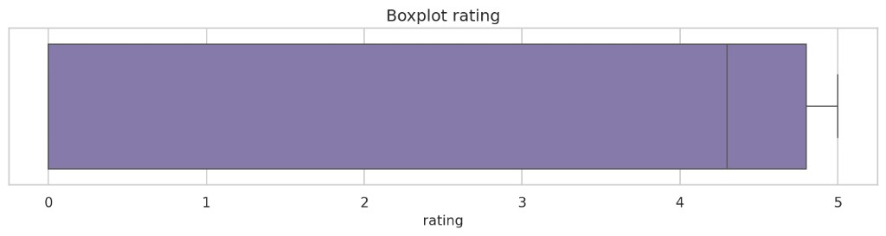

### 2.7 Giá
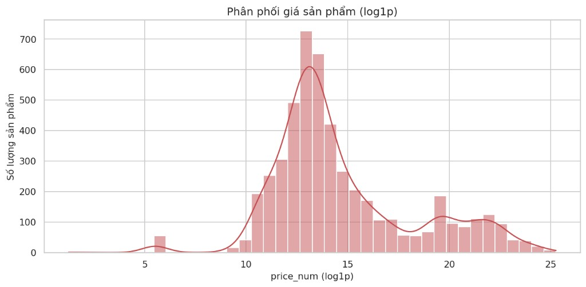
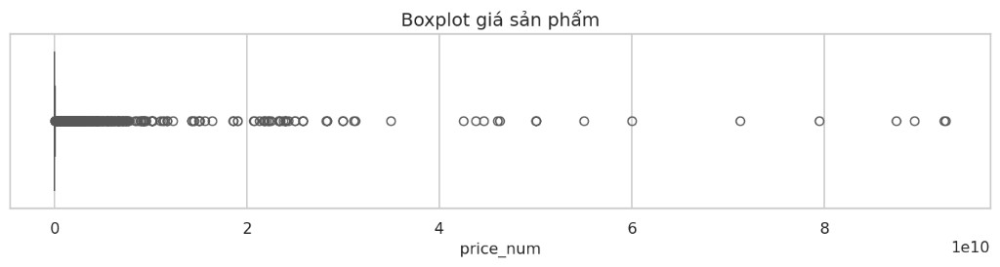

### 2.8 Rating vs reviews
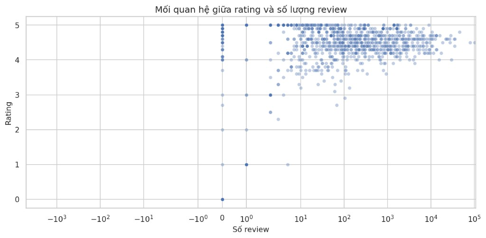

---

## 3. Pipeline

1. Encode E5 → Recall@n trên {10,20,30,50,75,100}
2. Chọn **selected_n = 10** → rerank 500×10 = **5000 cặp**
3. Grid k ∈ {5,10,20}
4. Ngưỡng: `run_threshold_only` → 2004 cặp (501 pos, 1503 neg)

---

## 4. n và k tối ưu

| n | Recall@n |
|---|----------|
| 10–100 | 1,0 |

| k | P | R | F1 | NDCG |
|---|---|---|---|------|
| 5 | 0,20 | 1,0 | 0,33 | 0,999 |
| 10 | 0,10 | 1,0 | 0,18 | 0,999 |

---

## 5. Ngưỡng triển khai

| Loại | τ | FPR | FNR | Error |
|------|---|-----|-----|-------|
| EER | 0,005 | 0 | 0 | 0 |
| Min error | 0,005 | 0 | 0 | 0 |

**Triển khai:** `score_reranker >= 0.005`

---

*Tạo từ `scripts/generate_e5_reranker_5000_report_docx.py` — file Word: `bao_cao_e5_reranker_5000.docx`*
